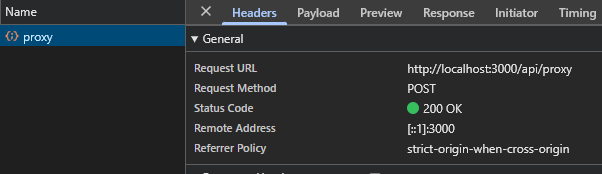
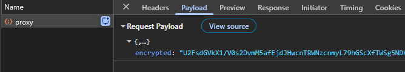
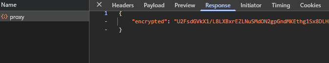

# Backend Proxy

A monorepo that encrypts frontend requests through a Next.js proxy to hide backend URLs and sensitive data from browser DevTools.

## ✅ Security Features

- Double encryption (public key + secret key)
- HMAC signature on all requests and responses
- Backend URLs hidden from client
- Payloads encrypted (invisible in DevTools)
- Relative URLs only (no external requests)
- Response signature verification

## 🔒 How It Works

```
Frontend
  ↓ [encrypt with public key]
Next.js API (http://localhost:3000/api/proxy)
  ↓ [decrypt + re-encrypt with secret key]
Backend API (http://localhost:3001/api/proxy)
  ↓ [decrypt + route internal request]
Internal API (e.g., /internal/api/people)
  ↓ [encrypt response + sign]
Backend API
  ↓ [decrypt + re-encrypt + sign]
Next.js API
  ↓ [decrypt + re-encrypt with public key]
Frontend
```

## Screenshots

- **Only `/api/proxy` is visible:**  
  The frontend never directly accesses backend endpoints. All requests are routed through the proxy.



- **Encrypted payload and response:**  
  Request body and Response shows `{ "encrypted": "..." }`, so sensitive data is obfuscated in the network tab.




## 📁 Structure

```
backend-proxy/
├── shared/          # Encryption utilities & types
├── frontend/        # Next.js app (port 3000)
└── backend/         # Hono API server (port 3001)
```

## 🚀 Setup

```bash
# Install dependencies
pnpm install

# Setup environment variables (see .env.example in each folder)

# Run all services
pnpm run dev
```

Services will start at:

- Frontend: http://localhost:3000
- Backend: http://localhost:3001

## 📦 Packages

### shared

Encryption & type utilities used by frontend and backend.

**Key exports:**

- `encrypt(data, key)` - Encrypt data
- `decrypt(encrypted, key)` - Decrypt data
- `signPayload(data, key)` - Create HMAC signature
- `verifySignature(data, signature, key)` - Verify signature

### frontend

Next.js frontend with encryption client.

**Key files:**

- `app/api/proxy/route.ts` - Proxy endpoint that re-encrypts requests
- `utils/api-proxy.ts` - Client utilities for encrypted requests

### backend

Hono backend with proxy endpoint.

**Key files:**

- `src/index.ts` - Proxy endpoint that routes decrypted requests
- `src/utils.ts` - Response encryption helpers
- `data/people.ts` - Sample data

## 🔐 Environment Variables

**Frontend (.env)**

```env
<!-- PUBLIC -->
NEXT_PUBLIC_PUBLIC_KEY=<base64_public_key>

<!-- SECRET -->
SECRET_KEY=<base64_secret_key>
SIGNATURE_KEY=<base64_hmac_key>
BACKEND_PROXY=http://localhost:3001/api/proxy
```

**Backend (.env)**

```env
SECRET_KEY=<base64_secret_key>
SIGNATURE_KEY=<base64_hmac_key>
INTERNAL_KEY=<base64_hmac_key>
FRONTEND_PROXY=http://localhost:3000/api/proxy
```

See `.env.example` in each folder for details.

## 📡 Request Format

**Frontend → Next.js Proxy:**

```json
{
  "encrypted": "base64_encrypted_string"
}
```

**Next.js Proxy → Backend (with signature verification):**

```json
{
  "encrypted": "base64_encrypted_string"
}
```

Header: `X-Signature: hmac_signature`

**Decrypted request payload format:**

```json
{
  "url": "/api/people",
  "method": "GET",
  "body": null
}
```
