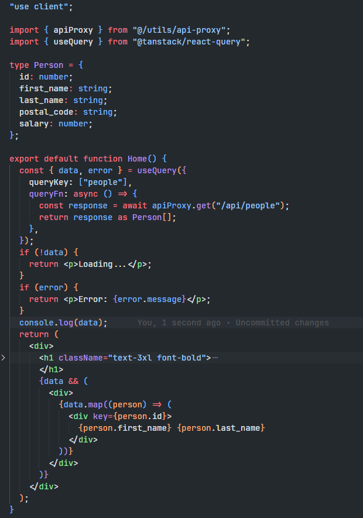
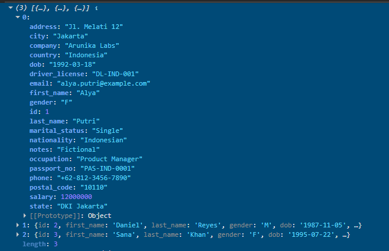

# Encrypted API Proxy

A monorepo setup that securely encrypts frontend API requests and routes them through a Next.js proxy, preventing exposure of backend URLs and sensitive data in browser DevTools.

> **Note:** This is a learning project created to understand encrypted proxy patterns observed in legacy internal applications. Modern meta-frameworks (Next.js Server Actions, Nuxt Server Routes, TanStack Start loaders, SvelteKit form actions) solve this natively with server-side data fetching. This implementation is for scenarios where server-side fetching isn't viable: third-party API integrations, legacy systems, HTTP-only internal networks, or microservices architecture.

## 🎯 The Problem

On HTTP-only internal networks, every API call is exposed in two critical ways:

1. **Network traffic is unencrypted** - Visible to anyone with packet capture tools
2. **DevTools exposes everything** - All backend URLs, request payloads, and response data are visible

This means sensitive business data, internal endpoints, and system architecture are all accessible to anyone on the company network—not ideal for HR systems, financial apps, or proprietary tools.

## 💡 The Solution

A double-encrypted proxy layer with HMAC signature verification that:

- Hides all backend URLs from the client
- Encrypts payloads end-to-end (even without HTTPS)
- Prevents tampering with HMAC signatures
- Protects internal routes with separate authentication

## ✅ Security Features

- Double encryption (public key + secret key)
- HMAC signature on all requests and responses
- Backend URLs hidden from client
- Payloads encrypted (obfuscated in DevTools)
- Relative URLs only (no external requests)
- Response signature verification

## 🔒 Security Model Overview

**Key Separation:**

- **Public Key:**

  - Used only for client-side obfuscation. It never grants backend access.
  - Safe to expose in frontend code.

- **Secret Key & Signature Key:**

  - Used together for secure communication between frontend and backend.
  - The backend verifies both payload and signature to prevent tampering.

- **Internal Key:**
  - Protects sensitive internal endpoints that should only be callable from within the backend itself.
  - Ensures external requests cannot trigger internal-only routes.

**This separation ensures:**

- Public UI can obfuscate data without exposing sensitive keys
- Communication between frontend and backend is authenticated and validated
- Internal backend routes cannot be triggered externally

## 🔒 How It Works

```
Frontend
  ↓ [encrypt with public key]
Next.js API (http://localhost:3000/api/proxy)
  ↓ [decrypt + re-encrypt with secret key + add HMAC signature]
Backend API (http://localhost:3001/api/proxy)
  ↓ [verify signature + decrypt + route internal request]
Internal API (e.g., /internal/api/people)
  ↓ [process + encrypt response + sign]
Backend API
  ↓ [decrypt + re-encrypt + sign]
Next.js API
  ↓ [verify signature + decrypt + re-encrypt with public key]
Frontend
  ↓ [decrypt + use data]
```

## 📸 Screenshots

### Only `/api/proxy` is visible

The frontend never directly accesses backend endpoints. All requests are routed through the proxy.


### Encrypted payload and response

Request body and Response shows `{ "encrypted": "..." }`, so sensitive data is obfuscated in the network tab.


### Data and Usage



### Console output shows decrypted data

This is what the `console.log(data)` looks like after decryption.



## 📁 Project Structure

```
encrypted-api-proxy/
├── shared/          # Encryption utilities & shared types
│   ├── encryption.ts
│   └── types.ts
├── frontend/        # Next.js app (port 3000)
│   ├── app/
│   │   └── api/proxy/route.ts
│   └── utils/api-proxy.ts
└── backend/         # Hono API server (port 3001)
    ├── src/
    │   ├── index.ts
    │   └── utils.ts
    └── data/people.ts
```

## 🚀 Quick Start

### Prerequisites

- Node.js 18+
- pnpm (recommended) or npm

### Installation

```bash
# Clone the repository
git clone https://github.com/nabilfikrisp/encrypted-api-proxy.git
cd encrypted-api-proxy

# Install dependencies
pnpm install

# Setup environment variables (see .env.example in each folder)
cp frontend/.env.example frontend/.env
cp backend/.env.example backend/.env

# Generate your own encryption keys (optional)
# Or use the example keys for testing

# Build all packages
pnpm run build:all

# Run all services
pnpm run start:all
```

Services will start at:

- **Frontend:** http://localhost:3000
- **Backend:** http://localhost:3001

## 📦 Packages

### `shared/`

Encryption & type utilities used by both frontend and backend.

**Key exports:**

- `encrypt(data, key)` - Encrypt data with AES-256
- `decrypt(encrypted, key)` - Decrypt encrypted data
- `signPayload(data, key)` - Create HMAC-SHA256 signature
- `verifySignature(data, signature, key)` - Verify HMAC signature

### `frontend/`

Next.js frontend with encryption client.

**Key files:**

- `app/api/proxy/route.ts` - Proxy endpoint that re-encrypts requests
- `utils/api-proxy.ts` - Client utilities for encrypted requests

**Usage:**

```typescript
import { apiClient } from "@/utils/api-proxy";

// Simple GET request
const data = await apiClient.get("/api/people");

// POST with body
const result = await apiClient.post("/api/users", { name: "John" });
```

### `backend/`

Hono backend with proxy endpoint and internal routes.

**Key files:**

- `src/index.ts` - Main server with proxy endpoint
- `src/utils.ts` - Response encryption helpers
- `data/people.ts` - Sample data for testing

## 🔐 Environment Variables

### Frontend (`.env`)

```env
# PUBLIC - Safe to expose
NEXT_PUBLIC_PUBLIC_KEY=your_base64_public_key_here

# SECRET - Keep these secure
SECRET_KEY=your_base64_secret_key_here
SIGNATURE_KEY=your_base64_hmac_key_here
BACKEND_PROXY=http://localhost:3001/api/proxy
```

| Variable                 | Description                                                                                    |
| ------------------------ | ---------------------------------------------------------------------------------------------- |
| `NEXT_PUBLIC_PUBLIC_KEY` | Public key for client-side obfuscation. Safe to expose in frontend code.                       |
| `SECRET_KEY`             | Shared secret key for encrypted communication with backend. Must match backend's `SECRET_KEY`. |
| `SIGNATURE_KEY`          | HMAC key for request signature generation. Must match backend's `SIGNATURE_KEY`.               |
| `BACKEND_PROXY`          | Backend proxy endpoint URL.                                                                    |

### Backend (`.env`)

```env
SECRET_KEY=your_base64_secret_key_here
SIGNATURE_KEY=your_base64_hmac_key_here
INTERNAL_KEY=your_base64_internal_key_here
FRONTEND_PROXY=http://localhost:3000/api/proxy
```

| Variable         | Description                                                                   |
| ---------------- | ----------------------------------------------------------------------------- |
| `SECRET_KEY`     | Must match frontend's `SECRET_KEY`. Used for decrypting encrypted payloads.   |
| `SIGNATURE_KEY`  | Must match frontend's `SIGNATURE_KEY`. Used for verifying request signatures. |
| `INTERNAL_KEY`   | Separate key for internal backend-to-backend route calls.                     |
| `FRONTEND_PROXY` | Allowed origin for CORS. Only this origin can call the backend proxy.         |

> 💡 **Security Note:** Never commit real keys to version control. Use `.env.local` for local development and secure environment variable management in production.

## 📡 Request Flow

### 1. Frontend → Next.js Proxy

```json
{
  "encrypted": "base64_encrypted_string"
}
```

### 2. Next.js Proxy → Backend

```json
{
  "encrypted": "base64_encrypted_string"
}
```

**Header:** `X-Signature: hmac_signature`

### 3. Decrypted Payload Format

```json
{
  "url": "/api/people",
  "method": "GET",
  "body": null,
  "headers": {}
}
```

## 🧪 Testing

```bash
# Test frontend API client
curl http://localhost:3000/api/test

# Check if encryption is working
# Open browser DevTools → Network tab
# You should only see encrypted payloads
```

## 🎓 What I Learned

Building this project taught me:

1. **Double encryption patterns** - Public key for obfuscation, secret key for security
2. **HMAC signature verification** - Preventing payload tampering
3. **Proxy architecture** - Hiding backend infrastructure from clients
4. **Key management** - Separating public, secret, and internal keys
5. **Monorepo structure** - Sharing types and utilities across packages

## ⚠️ When to Use This Pattern

**Use this when:**

- ✅ Working with HTTP-only internal networks
- ✅ Integrating third-party APIs that expose sensitive keys
- ✅ Legacy systems where refactoring isn't feasible
- ✅ Microservices requiring encrypted communication
- ✅ Client-side API calls that must happen in the browser

**Don't use this when:**

- ❌ You can use server-side data fetching (Next.js Server Actions, Nuxt Server Routes, etc.)
- ❌ HTTPS is available and sufficient for your security needs
- ❌ You're building a greenfield project with modern frameworks

## 🤝 Contributing

This is a learning project, but contributions are welcome! Feel free to:

- Report bugs or issues
- Suggest improvements
- Submit pull requests
- Share your own implementations

## 📝 License

MIT License - feel free to use this for learning or adapt it for your projects.

## 🙏 Acknowledgments

Inspired by encrypted proxy patterns observed in legacy internal applications. Built from scratch as a clean-room implementation to understand the underlying concepts.

---

**Built with:** Next.js 16 • Hono • TypeScript • pnpm

**Author:** [Nabil Fikri](https://github.com/nabilfikrisp)

⭐ If this helped you learn something new, consider giving it a star!
